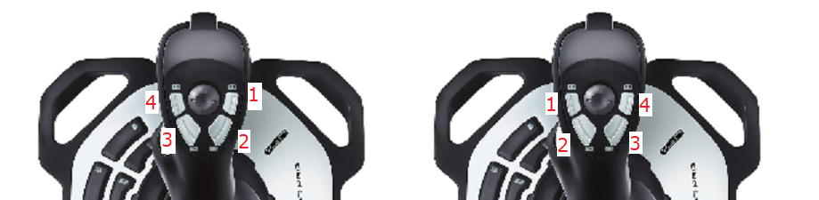

# wr_logic_teleop_ds

@defgroup wr_logic_teleop_ds wr_logic_teleop_ds
@brief Translates joystick controls to high-level drivetrain commands

This package takes inputs from 2 Logitech flight controllers and calculates a speed for the drive wheels in a tank drive configuration.

## Control Scheme

The control scheme this package creates is called tank drive, diagrammed below.

This control scheme is pretty simple to implement.  It also allows for easy manipulation of each side of the drive motors independently, compared to other controls schemes like power-steering.

Additionally, the buttons on the top of the joysticks act as speed modifiers.  When the left and right joysticks are held side by side (left on the left and right on the right), then as the buttons move from the inside, the modifiers step through speeds 1-4.  Power level settings are independent to each side of the robot; changing the left power modifier does not modify the right power modifier, etc.

## Watchdogs

This part of the system implements a watchdog to prevent a loss of network connectivity from creating a runaway robot.  We 'pet'@ref wr_logic_teleop_ds_1 "1" the watchdogs when we hear joystick messages over ROS.  If we do not 'pet' the watchdogs frequently enough, they 'get mad', and command a rover stop.

## Launching

This node can be launched by the `std.launch` file.  This file contains a parameterization for the speed multipliers for each of the 4 speed levels.  

@anchor wr_logic_teleop_ds_1 1. Other terminology refers to 'feeding' or 'kicking' the watchdog.  I don't like the last one.  Why would you be mean to the dog?
